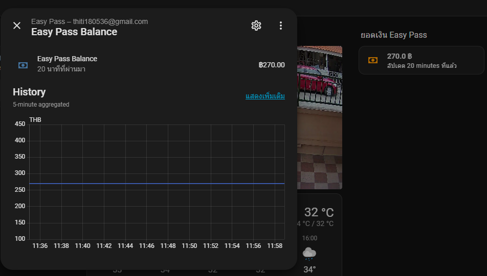
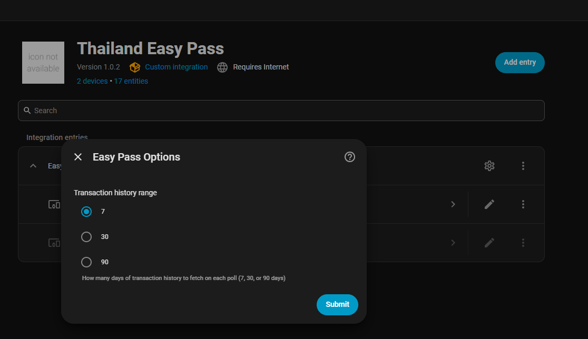

# Thailand Easy Pass — Home Assistant Integration

[](https://github.com/thititongumpun/ha-easypass-th)
[](https://www.home-assistant.io/)
[](LICENSE)

Monitor your **Thailand Easy Pass** (การทางพิเศษแห่งประเทศไทย) toll card balance, transaction history, and reward points directly in Home Assistant.  
Supports **multiple cards** on a single account — each card appears as its own device.




---

## What's new in 1.0.2

| # | Feature | Details |
|---|---------|---------|
| 1 | **Configurable transaction history range** | Choose 7 / 30 / 90 days instead of being locked to the current calendar month |
| 2 | **Manual refresh service** | Call `easypass_th.refresh` from an automation or Developer Tools to poll immediately |

> **Upgrading from 1.0.x?** See the [Upgrade guide](#upgrade-guide-10x--102) below — no migration needed.

---

## Features

- 💰 Real-time card balance (THB)
- 🌟 Reward points (คะแนน)
- 🚗 License plate per card
- 🪪 Card serial number (SmartCard S/N)
- 👤 Account owner name
- 🛣️ M-Flow registration status
- 📊 Toll spend over configurable history window (default 30 days)
- 📍 Last toll location (most recent tollgate passed)
- 🕐 Last transaction date and last top-up amount (from real history)
- **Multiple cards** — one HA device per card, all updated together
- New cards discovered automatically at the next poll (no reload needed)
- Polls every 30 minutes — session auto-renews on expiry
- Re-authentication UI when credentials change

---

## Installation

### Via HACS (recommended)

[](https://my.home-assistant.io/redirect/hacs_repository/?owner=thititongumpun&repository=ha-easypass-th&category=integration)

Or manually in HACS:

1. Open HACS → **⋮** → **Custom repositories**
2. Add URL: `https://github.com/thititongumpun/ha-easypass-th`
3. Category: **Integration**
4. Click **Add** → search **Thailand Easy Pass** → **Download**
5. Restart Home Assistant

### Manual

1. Download or clone this repository
2. Copy `custom_components/easypass_th/` into your HA config `custom_components/` folder
3. Restart Home Assistant

---

## Setup

1. **Settings → Integrations → + Add Integration**
2. Search **Thailand Easy Pass**
3. Enter your **email** and **password** used at [member-thaieasypass.exat.co.th](https://member-thaieasypass.exat.co.th)
4. Click **Submit**

All cards linked to that account are discovered automatically. Each card creates its own device named **Easy Pass – [license plate]**.

---

## Devices & Entities

### One device per card

Every card registered to your account becomes a separate HA device:

| Device name | When |
|-------------|------|
| `Easy Pass – กข 1234 กรุงเทพมหานคร` | Created on first load |
| `Easy Pass – กก 1234 เชียงใหม่` | Added automatically on next poll after registering a new card |

### 10 sensors per card

| Entity suffix | Description | Unit | Source |
|---------------|-------------|------|--------|
| `easy_pass_balance` | Card balance | THB | get-all API |
| `easy_pass_reward_points` | Reward points | คะแนน | get-all API |
| `easy_pass_license_plate` | Vehicle license plate | — | get-all API |
| `easy_pass_card_serial` | SmartCard serial (S/N) | — | get-all API |
| `easy_pass_account_owner` | Account holder name | — | get-all API |
| `easy_pass_m_flow_status` | M-Flow registration status | — | get-all API |
| `easy_pass_monthly_spend` | Total toll charges this month | THB | Usage history API |
| `easy_pass_last_toll_location` | Most recent tollgate name | — | Usage history API |
| `easy_pass_last_transaction` | Date of most recent toll | — | Usage history API |
| `easy_pass_last_top_up` | Most recent top-up amount | THB | Usage history API |

#### Extra attributes

**`easy_pass_balance`** also carries:
```
serial_number, license_plate, owner_name, recent_transactions (last 10)
```

Each entry in `recent_transactions`:
```yaml
- date: "09/05/2026 22:37:28"
  location: "ประชาชื่น (ขาเข้า)"
  type: "ผ่านทาง"   # toll
  amount: 60
  balance_after: 345.00
```

**`easy_pass_last_toll_location`** also carries:
```
txn_date, amount, balance_after
```

**`easy_pass_monthly_spend`** also carries:
```
transaction_count  (number of toll passages this month)
```

### Finding your entity IDs

Go to **Developer Tools → States** and filter by `easy_pass`.

Entity IDs follow the pattern:
```
sensor.easy_pass_[license_plate_slug]_easy_pass_balance
sensor.easy_pass_[license_plate_slug]_easy_pass_reward_points
sensor.easy_pass_[license_plate_slug]_easy_pass_monthly_spend
...
```

Example for license plate `กข 1234 กรุงเทพมหานคร`:
```
sensor.easy_pass_กข_1234_กรุงเทพมหานคร_easy_pass_balance
sensor.easy_pass_กข_1234_กรุงเทพมหานคร_easy_pass_monthly_spend
```

> Tip: HA converts spaces and special chars to `_` in entity IDs. Use **Developer Tools → States** to copy the exact ID.

---

## Dashboard Examples

> Replace the entity IDs below with your actual ones from Developer Tools → States.

### Balance card with low-balance alert colour

```yaml
type: custom:mushroom-template-card
primary: >
  {{ states('sensor.easy_pass_PLATE_easy_pass_balance') | float(0) | round(2) }} ฿
secondary: >
  อัปเดต {{ relative_time(states.sensor.easy_pass_PLATE_easy_pass_balance.last_updated) }} ที่แล้ว
icon: mdi:cash
icon_color: >
  
  redorangegreen
badge_icon: >
  
    mdi:alert
  
badge_color: red
```

### Balance gauge

```yaml
type: gauge
entity: sensor.easy_pass_PLATE_easy_pass_balance
name: ยอดเงินคงเหลือ
unit: ฿
min: 0
max: 1000
needle: true
severity:
  green: 300
  yellow: 100
  red: 0
```

### Monthly spend + reward points (Mushroom chips)

```yaml
type: custom:mushroom-chips-card
chips:
  - type: entity
    entity: sensor.easy_pass_PLATE_easy_pass_monthly_spend
    icon: mdi:cash-multiple
    name: ค่าทางด่วนเดือนนี้
  - type: entity
    entity: sensor.easy_pass_PLATE_easy_pass_reward_points
    icon: mdi:star-circle
    name: คะแนนสะสม
```

### Last toll location card

```yaml
type: custom:mushroom-template-card
primary: >
  {{ states('sensor.easy_pass_PLATE_easy_pass_last_toll_location') }}
secondary: >
  {{ state_attr('sensor.easy_pass_PLATE_easy_pass_last_toll_location', 'txn_date') }}
  — {{ state_attr('sensor.easy_pass_PLATE_easy_pass_last_toll_location', 'amount') }} ฿
icon: mdi:map-marker
```

### Multi-card overview (entities card)

```yaml
type: entities
title: Easy Pass ทุกใบ
entities:
  - entity: sensor.easy_pass_PLATE1_easy_pass_balance
    name: "บัตรที่ 1 – ยอดเงิน"
  - entity: sensor.easy_pass_PLATE1_easy_pass_monthly_spend
    name: "บัตรที่ 1 – ค่าทางด่วนเดือนนี้"
  - entity: sensor.easy_pass_PLATE2_easy_pass_balance
    name: "บัตรที่ 2 – ยอดเงิน"
  - entity: sensor.easy_pass_PLATE2_easy_pass_monthly_spend
    name: "บัตรที่ 2 – ค่าทางด่วนเดือนนี้"
```

### Low balance automation (triggers for any card)

```yaml
alias: Easy Pass ยอดเงินต่ำ
trigger:
  - platform: numeric_state
    entity_id:
      - sensor.easy_pass_PLATE1_easy_pass_balance
      - sensor.easy_pass_PLATE2_easy_pass_balance
    below: 100
action:
  - service: notify.mobile_app_your_phone
    data:
      title: "⚠️ Easy Pass ยอดเงินต่ำ"
      message: >
        บัตร {{ trigger.to_state.attributes.license_plate }}
        ยอดเงินคงเหลือ {{ trigger.to_state.state }} ฿
        กรุณาเติมเงินที่ https://member-thaieasypass.exat.co.th
```

### Transaction history table

Renders the full month's transaction list as an HTML table inside a Markdown card.  
No extra custom cards required — works with stock Home Assistant.

> Replace `PLATE` with your entity slug from **Developer Tools → States** (filter by `easy_pass_balance` to find your exact entity ID).

```yaml
- type: markdown
  content: |
    ## Easy Pass

    <table>
      <tr>
        <th>#</th>
        <th>วันที่</th>
        <th>ประเภท</th>
        <th>จำนวน</th>
        <th>คงเหลือ</th>
        <th>ด่าน</th>
      </tr>

      
      <tr>
        <td>{{ t.no }}</td>
        <td>{{ t.date }}</td>
        <td>{{ t.type }}</td>
        <td>{{ t.amount }}</td>
        <td>{{ t.balance_after }}</td>
        <td>{{ t.location }}</td>
      </tr>
      
    </table>
```

### Monthly spend automation (notify on high spend)

```yaml
alias: Easy Pass ค่าทางด่วนสูง
trigger:
  - platform: numeric_state
    entity_id: sensor.easy_pass_PLATE_easy_pass_monthly_spend
    above: 500
action:
  - service: notify.mobile_app_your_phone
    data:
      title: "🛣️ ค่าทางด่วนเดือนนี้สูง"
      message: >
        ใช้ไปแล้ว {{ states('sensor.easy_pass_PLATE_easy_pass_monthly_spend') }} ฿
        จาก {{ state_attr('sensor.easy_pass_PLATE_easy_pass_monthly_spend', 'transaction_count') }} ครั้ง
```

---

## How it works

Every 30 minutes the integration:

1. **Login** — POSTs credentials to `/eservice/login` (Laravel AJAX), receives session cookies
2. **Card list** — GETs `/eservice/easypasscardlist/get-all`; returns all cards with balance, reward points, license plate, owner, M-Flow status
3. **Usage history** — POSTs to `/eservice/easypasscardlist/usage` per card for the current calendar month; returns all toll and top-up transactions
4. **HA update** — Coordinator distributes the new data to all sensor entities; new cards discovered in step 2 get entities created automatically
5. **Session renewal** — On session expiry the scraper re-logs in automatically (up to 3 retries)
6. **Re-auth UI** — If credentials are rejected, HA shows a notification to re-enter your password

### Data flow summary

```
Login → get-all API ──► balance, reward points, license plate,
                        serial, owner, M-Flow  (per card)
             │
             └──► usage API ──► monthly spend, last toll location,
                                last transaction date, last top-up
```

---

## Requirements

- Home Assistant 2024.1+
- [Mushroom Cards](https://github.com/piitaya/lovelace-mushroom) (optional, for dashboard examples)
- Python packages (auto-installed by HA on first load): `requests`, `beautifulsoup4`, `lxml`

---

## License

MIT — see [LICENSE](LICENSE)
